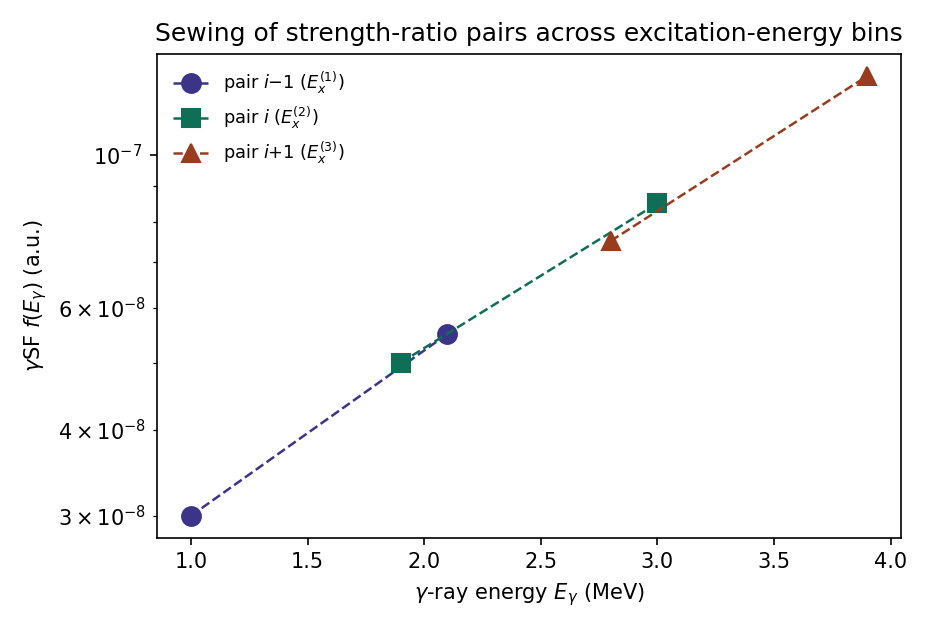

# The algorithm

!!! tip "New to the Shape method?"
    This page assumes you're already familiar with the ratio method itself.
    If not, start with [The basics](index.md#the-basics) on the home page —
    it walks through the same equation below using a simple level-scheme
    picture with every symbol labeled.

## Strength ratios from primary transitions

Primary γ rays de-exciting the quasicontinuum into a low-lying final level
$L_j$ appear in the (Eγ, Ex) matrix as a diagonal, since $E_x = E_\gamma + E_{Lj}$
(see [From decay scheme to matrix](index.md#from-decay-scheme-to-matrix)).
ShapeIt selects two such diagonals, $L_1$ and $L_2$ — in even–even nuclei
conveniently the first two $2^+$ states. For a given excitation-energy bin,
the number of counts integrated along each diagonal is proportional to
$f(E_\gamma)\,E_\gamma^3$ times population- and spin-dependent factors that
are common to both diagonals and cancel in the ratio

$$
R = \frac{f(E_x - E_{L1})}{f(E_x - E_{L2})} =
\frac{N_{L1}(E_x)\,(E_x - E_{L2})^3}{N_{L2}(E_x)\,(E_x - E_{L1})^3}
$$

| Symbol | Meaning |
|---|---|
| $E_x$ | Excitation energy of the current bin |
| $E_{L1}$, $E_{L2}$ | Energies of the two chosen final levels |
| $N_{L1}(E_x)$, $N_{L2}(E_x)$ | Integrated (or fitted) peak intensities at $E_{L1}$, $E_{L2}$ for this bin |
| $f(E_\gamma)$ | The γSF at γ-ray energy $E_\gamma$ |

so that each excitation-energy bin yields a pair of internally normalized
γSF data points at $E_\gamma^{(1)} = E_x - E_{L1}$ and
$E_\gamma^{(2)} = E_x - E_{L2}$.

Rather than using the nominal γ-ray energy of each level, ShapeIt assigns to
each point the **γSF-weighted centroid** of its diagonal projection, evaluated
over the integration window:

$$
\bar E_\gamma^{(j)} = \frac{\sum_{E_\gamma} E_\gamma\, f(E_\gamma)}{\sum_{E_\gamma} f(E_\gamma)}
$$

where $\bar E_\gamma^{(j)}$ is the plotted abscissa for level $j$'s point in
this bin, and the sums run over γ-ray energy channels within the peak's
integration window — this keeps the plotted abscissa consistent with the
strength actually
contained in the projection, rather than an arbitrary bin centre.

## Peak fitting

For a given excitation-energy bin, ShapeIt projects onto the internal
$(E_x-E_\gamma)$ axis (see [Defining the two levels](user-guide/defining-levels.md))
and locates the two peaks at $E_{L1}$ and $E_{L2}$. In **Autofit** mode,
each peak is fit with a Gaussian on a background (a quadratic form is
available; the background parameters are first determined from the two
flanking regions alone, then held fixed while the peak amplitude, centroid,
and width are optimized in the peak region). A level can optionally be fit
as a **doublet** — a second Gaussian is added to account for a close-lying
contaminant, such as a first-escape peak located 511 keV away from the
main peak (from pair-production escape). The two components share the same
width; only the second component's amplitude and centroid are independently
fit. Doublet windows are configured per level via the settings file
(`level1_2` / `level2_2` — see [Settings files](settings-files.md)) rather
than the main control panel.

A bin is discarded if either peak area falls below the **Min. Counts**
threshold, protecting the ratio $R$ against bins where a peak is not
statistically significant above background.

The peak width can be left free, or constrained to an
excitation-energy-dependent calibration $\sigma(E_\gamma) = p_0 + p_1 E_\gamma$
(with $\sigma$ the Gaussian width and $p_0$, $p_1$ fit constants) determined
beforehand from well-populated bins — this stabilizes fits in bins with low
statistics while preserving the natural growth of peak width with γ-ray
energy.

## Symmetric sewing

Equation for $R$ above fixes the two points of a pair *relative to each
other*, but not the absolute scale of the pair. ShapeIt connects successive
pairs into one continuous curve via **symmetric sewing**.

*Figure — Three strength-ratio pairs from three excitation-energy bins.
Each pair (dashed line) is rescaled so that neighbouring pairs agree with
each other in their region of overlap, building up the γSF shape bin by
bin.*

Let pair $i$ consist of the higher-energy point $(E_\gamma^{(1),i}, f_1^i)$
and the lower-energy point $(E_\gamma^{(2),i}, f_2^i)$, with slope

$$
s_i = \frac{f_1^i - f_2^i}{E_\gamma^{(1),i} - E_\gamma^{(2),i}}
$$

When attaching pair $i$ to the preceding pair $i-1$, both points of pair
$i$ are multiplied by the common rescaling factor

$$
c_i = \frac{2 f_1^{i-1} - \left(E_\gamma^{(1),i-1} - E_\gamma^{(2),i}\right) s_{i-1}}
{2 f_2^i + \left(E_\gamma^{(1),i-1} - E_\gamma^{(2),i}\right) s_i}
$$

| Symbol | Meaning |
|---|---|
| $E_\gamma^{(1),i}$, $f_1^i$ | γ-ray energy and γSF value of pair $i$'s higher-energy point (from $L_1$) |
| $E_\gamma^{(2),i}$, $f_2^i$ | γ-ray energy and γSF value of pair $i$'s lower-energy point (from $L_2$) |
| $s_i$ | Slope of the line joining pair $i$'s two points |
| $c_i$ | Rescaling factor applied to both points of pair $i$ when attaching it to pair $i-1$ |

This is exactly the condition that the linear extrapolations of pair $i-1$
and of the rescaled pair $i$ agree at the energy midway between their
adjoining endpoints — the vertical offsets of the two interpolating lines to
their crossing point are equal in magnitude, which gives the method its
name. Because both pairs are referred to a common midpoint (rather than one
pair being pinned to an endpoint of the other), the rescaling is
**independent of the direction of the chain** — the sewn shape no longer
depends on which bin the interpolation starts from, unlike the conventional
sewing prescription. The procedure fixes only the *shape* of the γSF; the
overall scale is set afterwards by a χ² comparison against the Oslo-method
result (see [Monte Carlo uncertainty](user-guide/monte-carlo-uncertainty.md)).

## Sliding-window and bin-size scans

Two deterministic scans test the sensitivity of the sewn shape to the
excitation-energy binning:

- **Sliding-window scan** — the excitation-energy grid is repeated with its
  lower edge displaced towards lower energies in $k_{max}-1$ steps of
  $\Delta E_x/(k_{max}-1)$, with $k_{max}=5$, while the upper edge stays
  fixed. Each shifted realization is normalized to the first (unshifted)
  one via a χ² fit.
- **Bin-size scan** — the bin width $\Delta E_x$ is increased from a
  user-specified minimum to a maximum in fixed steps of 50 keV, each
  realization again normalized to the first via a χ² fit.

The two can be combined (bin-size as the outer loop, sliding-window repeated
for each bin size). The resulting realizations can be inspected individually
("Show gSF single data") or pooled into a coarser grid reporting the mean
and standard deviation per bin ("Show gSF average") — the latter is what
feeds into the slope determination.

## Monte Carlo uncertainty on the slope correction

The scans above are qualitative, deterministic checks. To turn them into a
quantitative uncertainty on the slope correction $\alpha$, ShapeIt instead
**randomizes** the bin width, the lower excitation-energy edge, the peak
areas (resampled from a Gaussian using their fit uncertainty), and the
comparison (literature) γSF data (resampled within their quoted
uncertainty), then repeats the full extraction many times, recording the
best-fit $\alpha$ from a χ² comparison against the (resampled) Oslo-method
curve in each iteration. The resulting distribution of best-fit $\alpha$
values is close to Gaussian; its mean and standard deviation are taken as
the slope correction $\delta\alpha$ and its 1σ uncertainty. See
[Monte Carlo uncertainty and absolute level density](user-guide/monte-carlo-uncertainty.md)
for how to run this in the GUI.

## References

If you use ShapeIt in a publication, please cite:

- M. Wiedeking *et al.*, *Independent normalization for γ-ray strength functions: The shape method*, Phys. Rev. C **104** (2021) 014311. [doi:10.1103/PhysRevC.104.014311](https://doi.org/10.1103/PhysRevC.104.014311)
- D. Mücher, A. Spyrou, *ShapeIt: a software framework for the model-independent extraction of the γ-ray strength function and absolute partial level density with the Shape method*, Nucl. Instrum. Methods Phys. Res. A, in preparation.
- D. Mücher *et al.*, *Extracting model-independent nuclear level densities away from stability*, Phys. Rev. C **107** (2023) L011602. [doi:10.1103/PhysRevC.107.L011602](https://doi.org/10.1103/PhysRevC.107.L011602)
