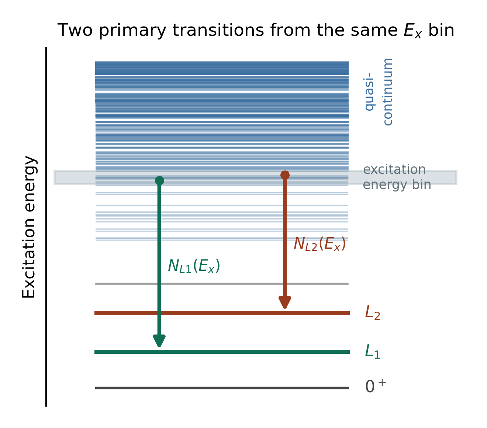

# ShapeIt

**ShapeIt** is an open-source, ROOT-based C++ framework that implements the
**Shape method** for the model-independent extraction of the γ-ray
strength function (γSF) and, in combination with the Oslo method, the
**absolute partial nuclear level density (NLD)** — with no dependence on
level-density models[^1].

!!! note "Status"
    This documentation tracks the `ShapeItLatest` branch of the
    [ShapeIt repository](https://github.com/dennismuecher/ShapeIt).

## The basics

The Oslo method extracts the NLD, $\rho(E_x)$ — the number of nuclear levels
per unit excitation energy $E_x$ — and the γSF, $f(E_\gamma)$ — the average
reduced probability for γ emission/absorption at γ-ray energy $E_\gamma$ —
simultaneously from a first-generation (primary) γ-ray matrix. But the
factorization underlying this extraction is only unique up to a
transformation

$$
\tilde\rho(E_x-E_\gamma) = A\,e^{\alpha(E_x-E_\gamma)}\rho(E_x-E_\gamma), \qquad
\tilde T(E_\gamma) = B\,e^{\alpha E_\gamma} T(E_\gamma),
$$

where $T(E_\gamma) \propto E_\gamma^3 f(E_\gamma)$ is the transmission
coefficient, $A$ and $B$ are overall normalization constants, and $\alpha$ is
a common **slope** shared by both quantities. Conventionally, $\alpha$ has
to be fixed using the level density at the neutron separation energy — data
that simply doesn't exist for short-lived nuclei far from stability.

### The ratio method: two decay paths from the same state

The **Shape method**[^1] removes this dependence. The idea is illustrated
below: an excited state at excitation energy $E_x$, sitting in the dense
quasicontinuum, can decay by a primary γ ray directly to either of two
known, low-lying discrete levels, $L_1$ or $L_2$. Call the number of counts
(intensity) observed in each of these two transitions
$N_{L1}(E_x)$ and $N_{L2}(E_x)$.

{ width="380" }

*Figure — Within a narrow excitation-energy window (grey band) in the
quasicontinuum, two states feed the known levels $L_1$ and $L_2$ via
primary γ transitions, with intensities $N_{L1}(E_x)$ and $N_{L2}(E_x)$.
The quasicontinuum itself is sketched with level density increasing towards
higher $E_x$, until individual levels blend into a true continuum.*

Taking the ratio of these two intensities (each corrected by $E_\gamma^3$,
since $T(E_\gamma)\propto E_\gamma^3 f(E_\gamma)$) gives directly the ratio
of the γSF at the two corresponding γ-ray energies:

$$
R = \frac{f(E_x - E_{L1})}{f(E_x - E_{L2})} =
\frac{N_{L1}(E_x)\,(E_x - E_{L2})^3}{N_{L2}(E_x)\,(E_x - E_{L1})^3}
$$

where:

| Symbol | Meaning |
|---|---|
| $E_x$ | Excitation energy of the initial (quasicontinuum) state |
| $E_{L1}$, $E_{L2}$ | Excitation energies of the two known, discrete final levels |
| $N_{L1}(E_x)$, $N_{L2}(E_x)$ | Measured intensities of the two primary transitions from $E_x$ — the two labeled arrows above |
| $E_x - E_{L1}$, $E_x - E_{L2}$ | The γ-ray energies of the two transitions |
| $f(E_\gamma)$ | The γ-ray strength function at γ-ray energy $E_\gamma$ |
| $R$ | The ratio of γSF values at those two γ-ray energies |

Because the population of the initial state and the density of states
around it are common to both transitions, they cancel exactly in $R$ — so
the γSF ratio comes out free of any level-density model input, under the
generalized Brink–Axel hypothesis. Repeating this for many different values
of $E_x$ gives a series of $(E_\gamma, f)$ pairs; connecting them with a
**sewing** interpolation then yields the γSF shape over a wide energy range
— and comparing that shape with an Oslo-method result for the same data set
fixes the slope $\alpha$ that the Oslo method alone cannot provide (see
[The algorithm](algorithm.md) for exactly how ShapeIt does this from a real
$(E_\gamma, E_x)$ matrix).

### From decay scheme to matrix

In real data, ShapeIt doesn't see a decay scheme — it works from a
two-dimensional $(E_\gamma, E_x)$ coincidence matrix. The two decay paths
above become two **diagonals** in that matrix, since each one obeys
$E_x - E_\gamma = E_{Lj} = \text{constant}$:

*Figure — The same two decay paths, now seen as diagonals $D_1$ and $D_2$ in
the $(E_\gamma, E_x)$ matrix. The excitation-energy gate (grey band) crossing
both diagonals is exactly the state $E_x$ shown in the level scheme above;
its two crossing points give the γ-ray energies of the two transitions.*

This is the representation [The user guide](user-guide/loading-a-matrix.md)
and [The algorithm](algorithm.md) work with directly.

## What ShapeIt adds on top of the method

- A **symmetric sewing** algorithm that removes the dependence of the sewn
  shape on the starting bin of the interpolation (see
  [The algorithm](algorithm.md)).
- Automated **peak fitting** (single or doublet) with an
  excitation-energy-dependent width calibration.
- **Sliding-window** and **bin-size** scans to inspect the sensitivity of
  the extracted shape to binning choices.
- A **Monte Carlo** procedure that turns those choices, together with
  statistical uncertainties, into a quantitative uncertainty on the slope
  correction $\alpha$ and, through it, on the absolute partial level
  density.

## Where to start

- [Installation](installation.md) — requirements and how to launch ShapeIt
- [Input data format](data-format.md) — what your ROOT matrix needs to look like
- [User guide](user-guide/loading-a-matrix.md) — step-by-step walkthrough,
  from opening a file to the absolute partial level density
- [The algorithm](algorithm.md) — the physics and math behind sewing and the
  Monte Carlo uncertainty
- [Settings files](settings-files.md) — saving and reloading your analysis setup

## Citing ShapeIt

If you use ShapeIt in a publication, please cite:

- D. Mücher, A. Spyrou, M. Wiedeking, M. Guttormsen, A. C. Larsen, F. Zeiser, C. Harris, A. L. Richard, M. K. Smith, A. Görgen, S. N. Liddick, S. Siem, *et al.*, *Extracting model-independent nuclear level densities away from stability*, Phys. Rev. C **107** (2023) L011602. [doi:10.1103/PhysRevC.107.L011602](https://doi.org/10.1103/PhysRevC.107.L011602)

The Shape method itself was introduced in:

- M. Wiedeking, M. Guttormsen, A. C. Larsen, F. Zeiser, A. Görgen, S. N. Liddick, D. Mücher, S. Siem, A. Spyrou, *Independent normalization for γ-ray strength functions: The shape method*, Phys. Rev. C **104** (2021) 014311. [doi:10.1103/PhysRevC.104.014311](https://doi.org/10.1103/PhysRevC.104.014311)

[^1]: M. Wiedeking, M. Guttormsen, A. C. Larsen, F. Zeiser, A. Görgen, S. N. Liddick, D. Mücher, S. Siem, A. Spyrou, *Independent normalization for γ-ray strength functions: The shape method*, Phys. Rev. C **104** (2021) 014311. [doi:10.1103/PhysRevC.104.014311](https://doi.org/10.1103/PhysRevC.104.014311)
