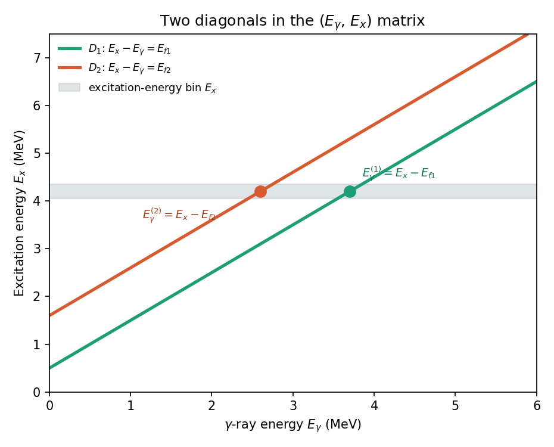
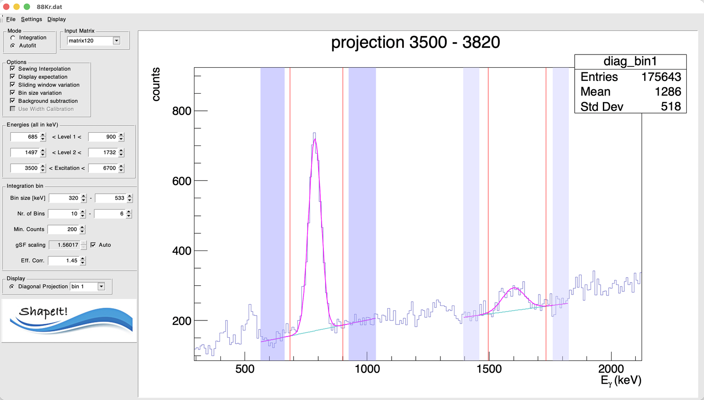

# 2. Defining the two levels

## The key idea: diagonals, not γ-ray windows

A primary γ ray that de-excites the quasicontinuum directly into a specific
low-lying final level $L_j$ obeys $E_x = E_\gamma + E_{Lj}$ — so in the
$(E_\gamma, E_x)$ matrix, all such transitions lie on a **diagonal line**,
regardless of which excitation-energy bin they started from. Equivalently,
along that diagonal, $E_x - E_\gamma = E_{Lj}$ is **constant**.

This is why ShapeIt can work with two simple energy windows instead of two
diagonal cuts: it internally re-bins the matrix onto an
$(E_x - E_\gamma)$ vs. $E_x$ grid, where each diagonal collapses to a
**vertical line** at $E_x - E_\gamma = E_{Lj}$ — i.e. at the (fixed) energy
of the fed level itself.

*Figure — Diagonals $D_1$ and $D_2$ in the $(E_\gamma, E_x)$ matrix,
corresponding to two known final levels (e.g. the $2^+_1$ and $2^+_2$
states in an even–even nucleus). For a given excitation-energy bin (grey
band), the crossing points with $D_1$ and $D_2$ give a pair of γ-ray
energies, $E_\gamma^{(1)} = E_x - E_{f1}$ and $E_\gamma^{(2)} = E_x - E_{f2}$.*

## Setting the level windows

In the **Energies (all in keV)** panel:

| Field | Meaning |
|---|---|
| Level 1 (low – high) | Window on the **Ex − Eγ** axis bracketing the first final level's energy, $E_{L1}$ |
| Level 2 (low – high) | Window on the **Ex − Eγ** axis bracketing the second final level's energy, $E_{L2}$ |
| Excitation (low – high) | The Ex range over which to step through excitation-energy bins |

$L_1$ and $L_2$ are typically the two lowest, best-resolved discrete states
below the level density in your nucleus — in even–even nuclei, conveniently
the first two $2^+$ states. The default values in a fresh session are just
placeholders from a previous analysis — replace them with the known energies
of the two final levels relevant to your nucleus.

!!! tip "How to pick good windows"
    Use **Display → Diag vs Excitation energy** to view the matrix re-binned
    onto the $(E_x-E_\gamma)$ vs. $E_x$ grid described above. Your two chosen
    levels should appear as two clear vertical lines; set the Level 1 / Level
    2 windows to bracket each line with a small margin.

## For each excitation-energy bin

Once the two level windows are set, ShapeIt will, for every excitation-energy
bin:

1. project that bin onto the $(E_x-E_\gamma)$ axis,
2. fit or integrate the two peaks at $E_{L1}$ and $E_{L2}$,
3. form the ratio of their (background-subtracted) intensities — which, after
   the $E_\gamma^3$ correction, is the ratio of the γSF at the two
   corresponding γ-ray energies $E_\gamma^{(1)} = E_x - E_{L1}$ and
   $E_\gamma^{(2)} = E_x - E_{L2}$ (see [The algorithm](../algorithm.md)).

Repeating this across all excitation-energy bins gives a series of
internally-normalized γSF pairs, which are then sewn together — see
[Choosing mode and binning](mode-and-binning.md) for how the bins are set
up, and [The algorithm](../algorithm.md) for the sewing itself.

## Peak and background markers

Once you run a fit (see [Running ShapeIt and reading results](running-and-results.md))
with **Autofit** mode and **Background subtraction** enabled, the per-bin
projection display shows draggable markers directly on the plot — this is
the actual way to fine-tune peak and background windows, rather than typing
numbers into a settings file.

{ width="80%" }

*A single excitation-energy bin's projection (3500–3820 keV here), in
Autofit mode with background subtraction on. Level 1's peak (left) and
Level 2's peak (right) are each fit with a Gaussian on a linear background
(magenta curve); the cyan segment under each peak is the fitted background
itself.*

- **Red vertical lines** mark each peak's integration/fit window (its low
  and high edge) — these correspond to the **Level 1** / **Level 2** number
  fields in the Energies panel. Dragging a red line with the mouse updates
  that window directly (equivalent to editing the corresponding number
  field).
- **Shaded bands** mark the two background windows flanking each peak —
  darker purple for Level 1's background regions, lighter purple for Level
  2's. Each band has a left and right edge you can drag independently,
  giving four adjustable markers per level in total.

!!! tip
    Dragging markers is the normal way to adjust these windows. The
    underlying values (`bg_level1`, `bg_level2` in the
    [settings file](../settings-files.md)) can also be hand-edited in a text
    editor, but if you do that, you need **Settings → Load Settings** to
    re-read the file before it takes effect — there's rarely a reason to
    prefer this over just dragging the markers.

## Background regions

Each level has **two background windows** (one below, one above the peak,
on the same Ex − Eγ axis) used for background subtraction and for the peak
fit in Autofit mode. They're saved/reloaded through the
[settings file](../settings-files.md) under the keys `bg_level1` and
`bg_level2`, each with four numbers: `low1 high1 low2 high2`.

You can check the currently active values at any time via
**Settings → Print Settings to terminal**.

## Fitting a peak as a doublet

Sometimes a level's peak sits right next to a contaminant — most commonly a
first-escape peak about 511 keV away (from pair-production escape) — that
you want to fit *simultaneously* so it doesn't distort the peak of interest.
ShapeIt supports this by fitting either level as a **doublet**: a second
Gaussian added alongside the main one.

This option is **not exposed in the GUI** — it's the one case where you do
need to hand-edit the [settings file](../settings-files.md). To fit a
doublet:

1. Open your settings file in a text editor.
2. Set the `level1_2` (for Level 1) and/or `level2_2` (for Level 2) key to
   the low and high edges of the *second* peak's window, on the same
   Ex − Eγ axis as the main level windows. Leave a key at `0 0` for a
   single (non-doublet) peak.
3. Save the file, then in ShapeIt use **Settings → Load Settings** to
   re-read it — hand edits don't take effect until you reload.

When a doublet is active, the two components are fit with the **same width**;
only the second component's amplitude and centroid are independently fit.
The intensity that enters the strength ratio is still just the main peak's —
the second component only serves to model the contaminant so it doesn't bias
the fit.

Next: [Choosing mode and binning](mode-and-binning.md).
