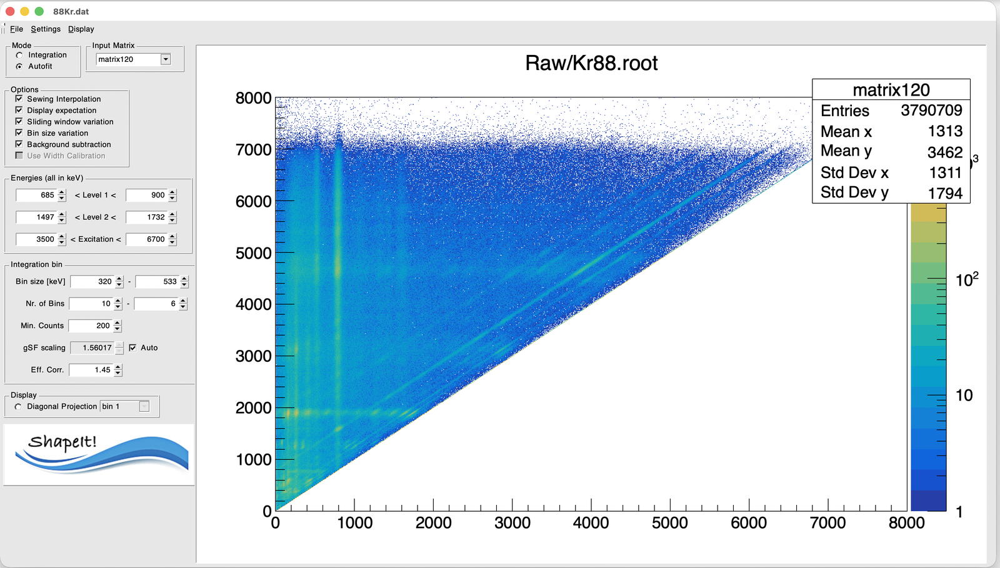

# 1. Loading a matrix

## Open a ROOT file

From the menu bar, choose **File → Load Matrix Root File...** and select
your `.root` file in the file dialog.

Once loaded:

- The **Input Matrix** dropdown (top-left, "Input Matrix" box) is populated
  with every `TH2` found in the file.
- The first matrix in the file is selected and displayed automatically.

## Inspect the raw matrix

Use **Display → Input Matrix** to draw the raw Eγ–Ex matrix you just loaded,
to confirm it looks as expected before doing any analysis.

Other useful display options at this stage:

| Menu item | Shows |
|---|---|
| Input Matrix | The raw $(E_\gamma, E_x)$ matrix as loaded |
| Diag vs Excitation energy | The matrix re-binned onto ShapeIt's internal $(E_x-E_\gamma)$ vs. $E_x$ grid — this is where diagonals become vertical lines (see [Defining the two levels](defining-levels.md)) |
| Diag Cube vs Excitation energy | Same, weighted by $E_x^3$ (used internally for uncertainty propagation) |

!!! tip
    If the matrix looks empty, transposed, or the axes look swapped, double
    check the axis convention in [Input data format](../data-format.md) —
    ShapeIt expects **Eγ on x, Ex on y** for the *raw input matrix*, both in
    keV. The "Diag" views are a different, re-binned representation (Ex − Eγ
    vs. Ex) that ShapeIt builds internally — see
    [Defining the two levels](defining-levels.md) for why.

## The control panel at a glance

Before going through the workflow step by step, here's what every field in
the left-hand control panel does. This is a reference to come back to —
the sections that follow go into more depth on the ones that matter most.

{ width="80%" }

*The ShapeIt main window after loading `Kr88.root`. The stat box (top right)
shows the usual ROOT histogram summary — entries, mean, and std. dev. for
both axes — for the currently displayed plot.*

| Panel | Field | What it does |
|---|---|---|
| **Mode** | Integration / Autofit | How each peak's area is measured in every excitation-energy bin — see [Choosing mode and binning](mode-and-binning.md). |
| **Input Matrix** | dropdown | Selects which `TH2` in the loaded file to analyze (a file can contain several). |
| **Options** | 6 checkboxes | Sewing, literature overlay, sliding-window/bin-size scans, background subtraction, width calibration — see [Options and sewing](options-and-sewing.md). |
| **Energies** | Level 1, Level 2, Excitation | The two final-level windows (on the Ex − Eγ axis) and the excitation-energy range to analyze — see [Defining the two levels](defining-levels.md). |
| **Integration bin** | Bin size [keV] | Width of each excitation-energy slice. The second field only activates with **Bin size variation** on. |
| | Nr. of Bins | Number of slices. Second field likewise only for the variation scan. |
| | Min. Counts | Minimum peak counts to accept a bin — see [Choosing mode and binning](mode-and-binning.md#min-counts). |
| | gSF scaling / Auto | Overall normalization of the extracted γSF — see [Choosing mode and binning](mode-and-binning.md#gsf-scaling-and-auto). |
| | Eff. Corr. | Correction factor multiplying Level 2's intensity — see [Choosing mode and binning](mode-and-binning.md#eff-corr). |
| **Display** | Diagonal Projection | Radio button + dropdown to page through the per-bin Ex − Eγ projections (and their fits, once computed) bin by bin. |

Next: [Defining the two levels](defining-levels.md).
