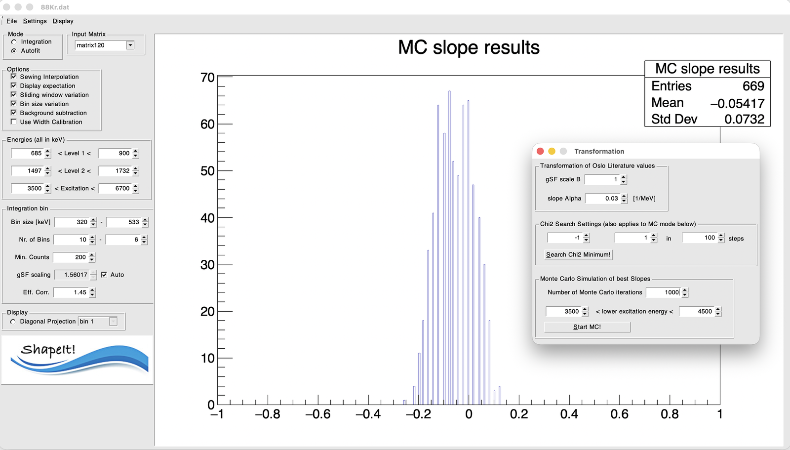

# 6. Monte Carlo uncertainty and absolute level density

Once you have a sewn γSF you're happy with, the final step is to compare it
with an Oslo-method result for the same data set, determine the slope
correction $\alpha$, and — if you also load an Oslo-method level density —
turn that into an **absolute partial level density**.

## Load the comparison (Oslo-method) data

Under **Settings → Load Literature Values gSF...**, load the Oslo-method γSF
for the same nucleus/data set. Enable **Display expectation** (see
[Options and sewing](options-and-sewing.md)) to overlay it with your sewn
result.

## Open the Transformation dialog

**Settings → Transformation...** opens a dialog with three sections.

### Transformation of Oslo literature values

- **gSF scale B** and **slope Alpha** — the two parameters of the Oslo
  transformation (see [The algorithm](../algorithm.md)). Changing either
  updates the overlaid literature curve live, so you can see the effect
  interactively.

### χ² search settings

- **Alpha range** (`< Alpha <`) and **steps** — the range and resolution of
  the trial slope values scanned.
- **Search Chi2 Minimum!** — runs a single, deterministic χ² scan over that
  range for your *current* configuration (current bins, current fit
  settings, current comparison data) and reports the best-fit $\alpha$.

!!! note
    This single-configuration search is a fast sanity check, but it only
    reflects the uncertainty of one particular choice of bins and fit
    settings. For a proper uncertainty estimate, use the Monte Carlo section
    below.

### Monte Carlo simulation of best slopes

- **Number of Monte Carlo iterations** — typically a few hundred to a
  thousand.
- **Lower excitation energy / Higher excitation energy** — the window from
  which the *lower edge* of the excitation-energy range is redrawn on each
  iteration (this plays the role of the sliding-window variation, but as a
  continuous random draw rather than a fixed grid of shifts).
- **Start MC!** — runs the randomized procedure. The button toggles to a
  stop control while running, so you can interrupt a long run early.

On each iteration, ShapeIt redraws:

1. the excitation-energy bin width (uniformly, over the same range as the
   deterministic bin-size scan),
2. the lower edge of the excitation-energy range (uniformly, over the range
   set above),
3. the peak areas of both diagonals in every accepted bin (from a Gaussian
   centred on the fitted value, width = its statistical uncertainty), and
4. the comparison γSF data itself (from a Gaussian centred on each published
   point, width = its quoted uncertainty),

then repeats diagonal extraction, peak fitting, and symmetric sewing from
scratch, and records the best-fit $\alpha$ from a χ² comparison against the
(resampled) comparison curve.

## Reading the result

{ width="80%" }

*Result of 1000 requested iterations for* `88Kr.dat` *(the Transformation
dialog is open on top, showing the settings used for this run). The stat
box reports 669 **Entries** — fewer than the 1000 requested, most likely
because the run was stopped early via the Start/Stop toggle; if you let a
run finish, Entries should match your requested iteration count.*

The accumulated best-fit $\alpha$ values form a histogram that is close to
Gaussian. Its **mean** is the slope correction $\delta\alpha$ relative to
the literature normalization, and its **standard deviation** is the
corresponding 1σ uncertainty (see [The algorithm](../algorithm.md)) — in
this example, $\delta\alpha = -0.054 \pm 0.073\,\text{MeV}^{-1}$.

## Getting to the absolute partial level density

$\delta\alpha$ is exactly the parameter that the level density at the
neutron separation energy would otherwise have had to supply. Apply it to
your Oslo-method level density via the same transformation (with the
low-energy normalization still anchored to known discrete levels, as usual)
to obtain the absolute partial level density — now fixed without reference
to a level-density model. Use **Display → Draw level density** and
**Display → Print Table of rho results** to inspect and export it, and
**Settings → Load Literature Values rho...** to overlay a comparison, e.g.
a TALYS-based level-density model.
