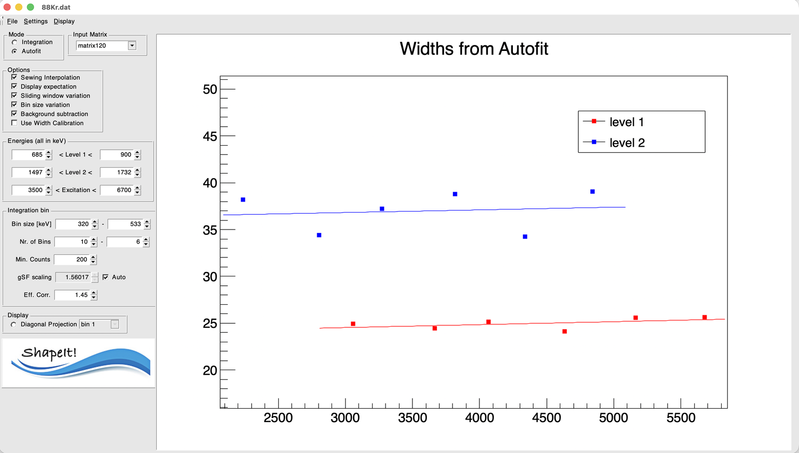

# 4. Options and sewing

The **Options** box controls how the two level-branches are processed and
combined.

| Checkbox | Effect |
|---|---|
| Sewing Interpolation | Applies the symmetric-sewing algorithm to rescale and merge the Level 1 and Level 2 curves into one gSF curve (see [The algorithm](../algorithm.md)). Turn this off to inspect the two raw branches separately. |
| Display expectation | Overlays literature (Oslo-method style) expectation values loaded via **Settings → Load Literature Values gSF...**, for comparison against your extracted points. |
| Sliding window variation | Repeats the extraction with the excitation-energy grid's lower edge shifted towards lower energies in 4 steps (5 realizations total, including the unshifted one), each normalized to the unshifted realization via a χ² fit — a deterministic check of sensitivity to bin placement. |
| Bin size variation | Repeats the extraction across a range of bin sizes in fixed 50 keV steps (activates the second "Bin size" / "Nr. of Bins" fields — see [Choosing mode and binning](mode-and-binning.md)), each realization normalized to the first via a χ² fit. |
| Background subtraction | Subtracts the background estimated from each level's flanking background windows before computing the gSF (see [Choosing mode and binning](mode-and-binning.md) for exactly how this interacts with Integration vs. Autofit mode). |
| Use Width Calibration | Uses a peak-width calibration (fit once, then reused) instead of re-fitting the width independently in every bin — see below. Only enabled after a first successful `ShapeIt` run in Autofit mode. |

Both variation checks can be combined (bin-size as the outer loop, sliding
window repeated for each bin size), and the resulting set of realizations
can be inspected individually (**Display → Show gSF single data**) or pooled
into a mean and standard deviation per bin (**Display → Show gSF average**)
— see [Running ShapeIt and reading results](running-and-results.md) for how
that pooling and its error bars are actually calculated.

## Width calibration

Run `ShapeIt` once in **Autofit** mode with the width left free: for every
excitation-energy bin, the Gaussian fit determines a peak width for Level 1
and Level 2 independently. **Display → Show Peak Width** plots these fitted
widths against each level's γ-ray energy (the γSF-weighted centroid — see
[The algorithm](../algorithm.md)), and fits a straight line through each
level's points:

{ width="80%" }

*Fitted peak widths vs. γ-ray energy for Level 1 (red) and Level 2 (blue),
each with its own linear fit — this is the calibration
$\sigma(E_\gamma) = p_0 + p_1 E_\gamma$ from [The algorithm](../algorithm.md).*

Once this calibration exists, checking **Use Width Calibration** makes
every subsequent fit use the calibrated width (evaluated at that bin's γ-ray
energy) instead of fitting the width freely. This often gives more stable
results: in a bin where a peak is weak, contaminated, or the free fit
otherwise struggles, a sensible preset width keeps the fit well-behaved
instead of drifting to an unphysical value.

## A note on doublet peaks

If you've set up a doublet for a level (via `level1_2` / `level2_2` in the
[settings file](../settings-files.md#file-format)), the second Gaussian
component is fit with the **same width** as the primary peak — only its
amplitude and centroid are free.

!!! tip "A sensible starting configuration"
    For a first pass: enable **Sewing Interpolation** and
    **Background subtraction**, leave the variation checks off until your
    basic extraction looks reasonable, then turn on **Sliding window
    variation** and/or **Bin size variation** to gauge systematic
    uncertainties.

Next: [Running ShapeIt and reading results](running-and-results.md).
