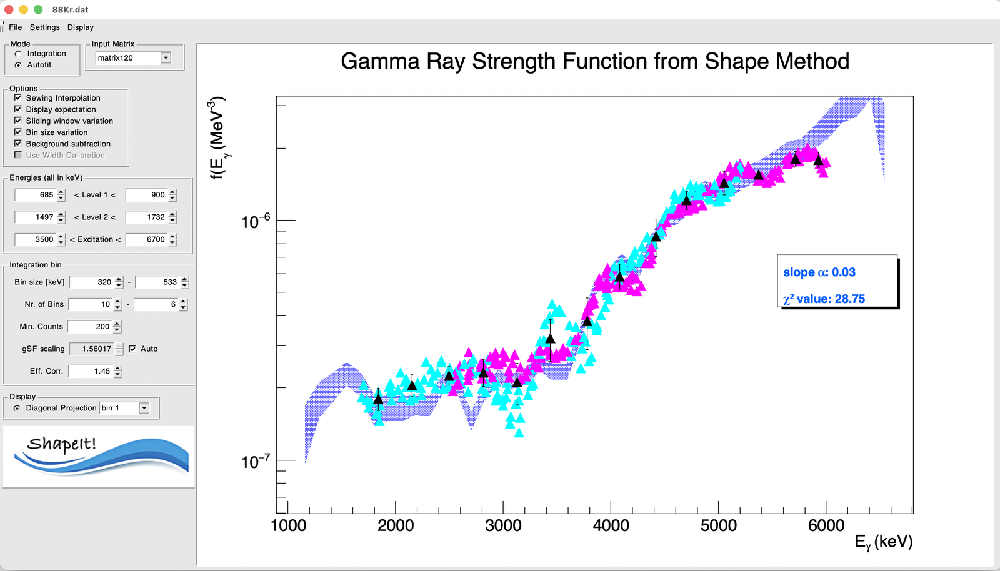

# 5. Running ShapeIt and reading results

## Run the extraction

Once you've set the levels, excitation range, mode, and options, click the
**ShapeIt logo button** at the bottom of the control panel. This:

1. Applies your current GUI settings.
2. Steps through the excitation-energy bins, extracting Level 1 and Level 2
   intensities in each (by integration or fit, per your chosen mode).
3. Converts intensities to relative gSF values.
4. Applies sewing (if enabled) to merge the two branches.
5. Plots the resulting gSF graph automatically.

!!! note
    If you haven't loaded a matrix yet, ShapeIt will show an error dialog
    ("No Matrix loaded!") instead of running.

## Reading the plot

- **Level 1** points are magenta, **Level 2** points are cyan; the
  merged/sewn curve overlays both once sewing is enabled.
- Each point's γ-ray energy (x-axis position) is the **γSF-weighted
  centroid** of that bin's peak-integration window, not the nominal peak
  centre — this keeps the plotted position consistent with where the
  strength actually sits within the window (see
  [The algorithm](../algorithm.md)).
- If **Display expectation** is on, literature values are overlaid for
  comparison.

## Reading the averaged plot

If **Sliding window variation** and/or **Bin size variation** are enabled
(see [Options and sewing](options-and-sewing.md)), ShapeIt produces many
individual realizations of the sewn γSF — one per combination of bin
placement/bin size. **Display → Show gSF single data** plots every one of
them on top of each other (still colour-coded magenta/cyan by level); with
enough realizations this naturally looks like a dense band rather than
discrete points.

{ width="80%" }

*All individual sliding-window/bin-size realizations (magenta = Level 1,
cyan = Level 2), with the pooled bin-by-bin average overlaid in black
(triangles, with error bars) via* **Display → Show gSF average**. *The
inset box shows the slope correction $\alpha$ and χ² from the currently
loaded [Transformation](monte-carlo-uncertainty.md) settings.*

**Show gSF average** pools all of those individual realizations together and
re-bins them along the γ-ray energy axis (using the primary **Bin size
[keV]** setting as the pooling width). For each such bin, the black point
is placed at:

- **x** — the plain mean of the γ-ray energies of every individual point
  falling in that bin.
- **y** — the plain mean of their γSF values.

and its error bar combines, in quadrature, two things:

- the **standard deviation** of the individual γSF values in that bin
  (reflecting how much the different sliding-window/bin-size realizations
  actually disagree with each other), and
- the **largest single statistical error bar** among the individual points
  in that bin (so a bin isn't reported as artificially precise just because
  its realizations happened to agree).

This combined black curve — not the raw scatter of individual realizations
— is what feeds into the slope determination described in
[Monte Carlo uncertainty and absolute level density](monte-carlo-uncertainty.md).

## Other results views

Once a run has completed, these become available under **Display**:

| Menu item | Shows |
|---|---|
| Show Peak Width | Fitted peak widths across excitation-energy bins (Autofit mode only) — see [width calibration](options-and-sewing.md#width-calibration) |
| Show gSF average | The pooled, bin-averaged γSF curve (black points) — see above |
| Show gSF single data | Every individual sliding-window/bin-size realization (magenta/cyan points) — see above |
| Print Table of gSF results | Prints a numeric table of Eγ, gSF, and uncertainty to the terminal |
| Print Table of rho results | Prints the corresponding level-density (ρ) table |
| Draw level density | Plots the extracted level density |

## Iterating

Adjust the level windows, background windows, binning, or options and press
the ShapeIt button again — each run recomputes from scratch using the
current settings. Once you're happy with a configuration, save it as
described in [Settings files](../settings-files.md) so you can reproduce or
share the analysis later.

To turn your sewn γSF into a properly quantified slope correction and an
absolute partial level density, continue to
[Monte Carlo uncertainty and absolute level density](monte-carlo-uncertainty.md).
